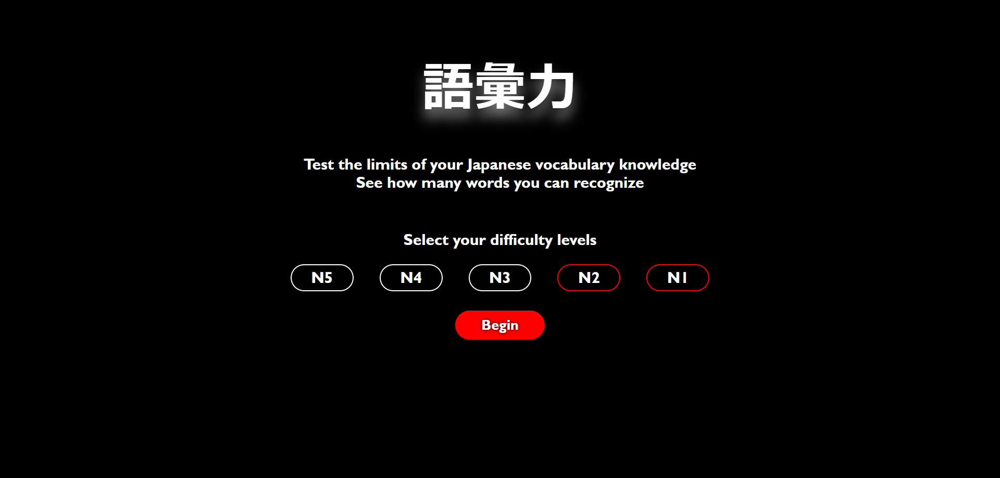
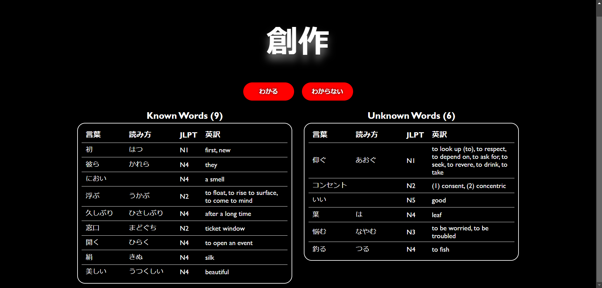

# Goiryoku
URL: [https://ericzhao9482.github.io/Goiryoku/](https://ericzhao9482.github.io/Goiryoku/) 
A web app built using React made for Japanese language learners who want to test their vocabulary.

Vocabulary csv files were used from the [Yomitan JLPT Vocab](https://github.com/stephenmk/yomitan-jlpt-vocab) repository.

Select your difficulties based on JLPT level and the site will randomly generate words based on your selected difficulties.

The site will keep track of a list of the words you mark as known or unknown and will reveal their reading and english translation for you to reivew later. 